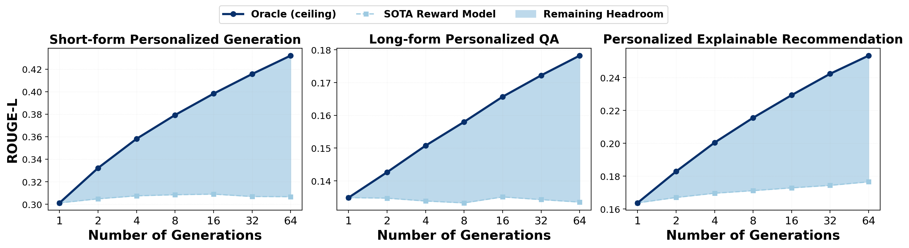
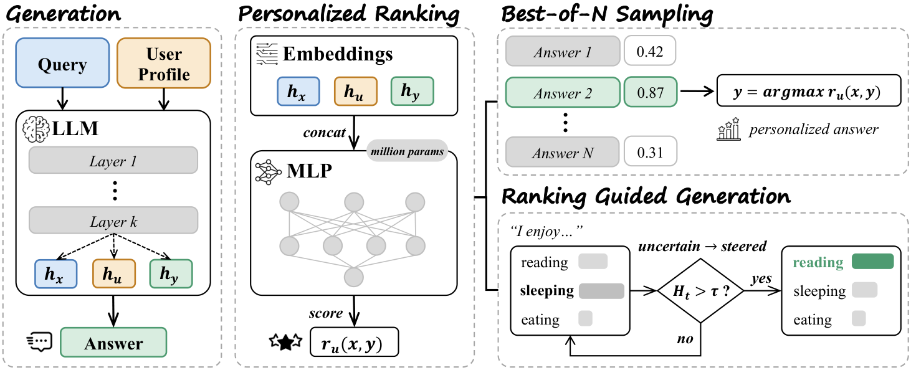

# Rethinking Personalized Generation: Test-Time Alignment via Lightweight Ranking Models

Code for the paper *Rethinking Personalized Generation: Test-Time Alignment via Lightweight Ranking Models* (under review at ICLR 2027).

The base generator already produces well-personalized responses; what is missing is a way to pick them out. When the evaluation metric selects the best of *N* sampled candidates (oracle), alignment with the user's own reference keeps rising with *N*. When a state-of-the-art reward model selects, it plateaus almost immediately.



We therefore train a **million-parameter MLP ranker** on the generator's own final-layer hidden states for the query (*h_x*), the user profile (*h_u*) and each candidate (*h_y*). No text is re-encoded and no per-user parameters are learned. The ranker is supervised with within-pool standardized ROUGE-L of on-policy candidates. It selects candidates for Best-of-N and can also steer greedy decoding on uncertain tokens (ranking-guided generation).



## Repository layout

```
rethinking/                 importable library
  datasets.py               dataset registry, file layout, prompt construction
  lamp.py                   LaMP BM25 prompt construction (adapted from the LaMP benchmark code)
  ranker.py                 PersonalizedRanker (MLP over [h_x ; h_u ; h_y]) and the 1M/3M/10M/30M sizes
  losses.py                 pointwise / pairwise / listwise ranking objectives
  pools.py                  candidate pools as tensors, Best-of-N evaluation
  reward_models.py          adapters for Skywork-V2, InternLM2, URM, ArmoRM
  guided.py                 entropy-gated ranking-guided decoding
scripts/                    pipeline (one script per stage, see below)
baselines/                  personalized reward-model baselines of App. B.3 (PAL, VPL, PReF, LoRe, GPO, SynthesizeMe)
analysis/                   appendix analyses: cross-metric transfer, user history, inference cost
configs/fsdp.yaml           accelerate FSDP config for finetuning the 8B comparator
```

## Setup

```bash
conda create -n rethinking python=3.11 -y && conda activate rethinking
pip install -r requirements.txt
pip install -e .
```

The experiments use `Qwen/Qwen2.5-7B-Instruct` as the generator and the reward models listed above, all from the Hugging Face Hub. Sampling and embedding need one GPU with at least 40 GB of memory per process. Finetuning the 8B comparator needs about 200 GB of GPU memory in total; we used two B200 GPUs.

## Data

Everything lives under `data/<Dataset>/`. The nine datasets and their splits are:

| Family | Datasets | Ranker training split | Evaluation split |
|---|---|---|---|
| LaMP (short-form) | `LaMP_4` News, `LaMP_5` Scholarly, `LaMP_7` Tweet | `train` | `dev` |
| LaMP-QA (long-form) | `LaMPQA_Art_and_Entertainment`, `LaMPQA_Lifestyle_and_Personal_Development`, `LaMPQA_Society_and_Culture` | `train` (90%) | `dev` (10%) |
| XRec (explainable rec.) | `XRec_amazon`, `XRec_yelp`, `XRec_google` | `train` (first 3,000) | `test` |

**LaMP.** Download the official files from the [LaMP benchmark](https://lamp-benchmark.github.io/download) and place them as `data/LaMP_<k>/{train,dev}_questions.json` and `data/LaMP_<k>/{train,dev}_outputs.json`. The prompts are built on the fly with the benchmark's BM25 retrieval (top-3 profile items).

**LaMP-QA.** The script below downloads the LaMP-QA test split. It takes the per-user reference answers from [Personalized-RewardBench](https://huggingface.co/datasets/QiyaoMa/Personalized-RewardBench), whose question ids match LaMP-QA. It then applies the 90/10 train/evaluation split with seed 0.

```bash
python scripts/prepare_lampqa.py
```

**XRec.** Download the data of [XRec](https://github.com/HKUDS/XRec), which provides `data/<ds>/{trn,tst}.pkl`, then run:

```bash
python scripts/prepare_xrec.py --src_dir /path/to/XRec/data
```

## Pipeline

`scripts/run_pipeline.sh <Dataset>` runs steps 1 to 6 for one dataset. The individual stages are:

```bash
# 1. candidate pools: 256 samples per prompt, temperature 1.0 (512 new tokens; 128 for XRec)
GPUS=0,1,2,3 bash scripts/run_sampling.sh LaMP_7 train
GPUS=0,1,2,3 bash scripts/run_sampling.sh LaMP_7 dev

# 2. per-candidate ROUGE-1 / ROUGE-L / BLEU against the user's reference
python scripts/score_candidates.py --dataset LaMP_7 --split train
python scripts/score_candidates.py --dataset LaMP_7 --split dev

# 3. last-token hidden states h_x, h_u, h_y (first 64 candidates)
python scripts/embed.py --dataset LaMP_7 --split train
python scripts/embed.py --dataset LaMP_7 --split dev

# 4. train the ranker and evaluate Best-of-N (default 2.8M MLP, pointwise MSE)
python scripts/train_ranker.py --dataset LaMP_7
python scripts/train_ranker.py --dataset LaMP_7 --size 30M            # size sweep: 1M 3M 10M 30M
python scripts/train_ranker.py --dataset LaMP_7 --loss listmle        # objective ablation
python scripts/train_ranker.py --dataset LaMP_7 --inputs xy           # input ablation (no profile)

# 5. generalist reward-model baselines (first 1,000 evaluation prompts)
for rm in skywork internlm urm armorm; do
  python scripts/score_reward_model.py --rm $rm --dataset LaMP_7; done

# 6. ranking-guided generation (tau=1, H_max=8, alpha0=5, warmup 3) and its sensitivity grid
python scripts/guided_generation.py --dataset LaMP_7 --ckpt checkpoints/ranker/LaMP_7/3M_mse --grid sensitivity

# 7. finetuned 8B comparator (Figure 4): same pointwise objective as the ranker, then score
accelerate launch --config_file configs/fsdp.yaml --num_processes 2 \
  scripts/finetune_reward_model.py --dataset LaMP_7 --out checkpoints/rm_ft/LaMP_7
python scripts/score_reward_model.py --rm skywork --model_path checkpoints/rm_ft/LaMP_7 --tag skywork_ft \
  --dataset LaMP_7 --max_examples 0 --max_length 2048 --fit_response
```

For LaMP-QA, pass `--epochs 2 --prompts_per_micro 3 --grad_accum 4` to the finetuning script.

## Reproducing the figures and tables

After running the pipeline on all nine datasets:

```bash
python scripts/collect_results.py                 # results/figdata.json and the headroom summary
python scripts/plot_figures.py                    # Figures 1, 3, 4 and appendix Figures 5-7
python scripts/print_tables.py objectives         # Table 2 (ranking objectives)
python scripts/print_tables.py guided             # Table 7 (guided-generation sensitivity)
```

The Best-of-N curves in Figures 1 and 3 use the prompts scored by all four generalist reward models. The size comparison in Figure 4 and the tables use the full evaluation split. The appendix analyses are documented in [analysis/README.md](analysis/README.md) and the personalized reward-model baselines in [baselines/README.md](baselines/README.md).

## Protocol summary

| Component | Setting |
|---|---|
| Generator | Qwen2.5-7B-Instruct, 256 samples per prompt, temperature 1.0; the first 64 are used |
| Embeddings | final-layer last-token states of the frozen generator, *d* = 3584 |
| Ranker | MLP over [*h_x*; *h_u*; *h_y*], GELU, dropout 0.1, width 256, 3 linear layers (2.8M parameters) |
| Training | MSE to within-pool z-scored ROUGE-L, AdamW lr 5e-4, weight decay 0.01, 15 epochs, batch 64 prompts, clip 1.0, seed 0 |
| Guided decoding | greedy, entropy gate tau = 1, H_max = 8, alpha0 = 5, 3-token warmup |
| 8B comparator | Skywork-Reward-V2-Llama-3.1-8B, full finetune, group-centred MSE, 1,500 prompts x 8 candidates, lr 2e-5, 1 epoch (2 for LaMP-QA) |

## Citation

```bibtex
@inproceedings{rethinking2027personalized,
  title     = {Rethinking Personalized Generation: Test-Time Alignment via Lightweight Ranking Models},
  author    = {Anonymous},
  booktitle = {Submitted to the International Conference on Learning Representations (ICLR)},
  year      = {2027}
}
```

## Acknowledgements

The LaMP prompt construction in `rethinking/lamp.py` is adapted from the [LaMP benchmark code](https://github.com/LaMP-Benchmark/LaMP). We thank the authors of LaMP, LaMP-QA, XRec, and of the reward models and baselines we compare against for releasing their data and code.
